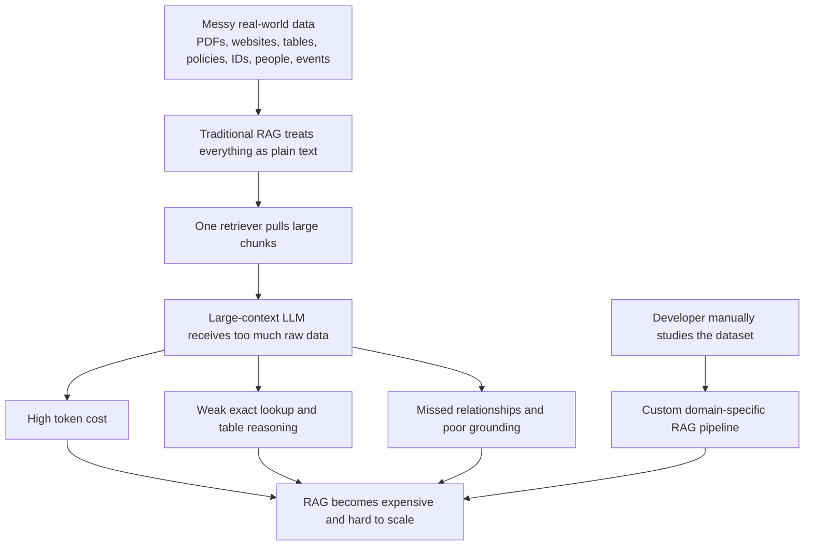
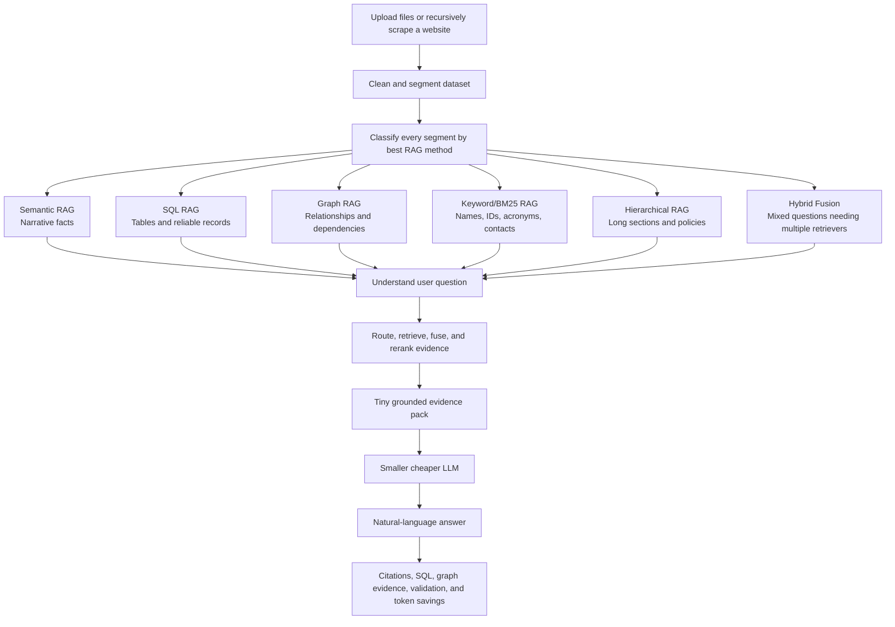

# RAGPilot

## Overview

RAGPilot is a universal Adaptive Multi-RAG Orchestrator. It ingests mixed data such as PDFs, DOCX files, TXT/MD files, CSV/XLSX tables, and websites, then decides which retrieval strategy each part of the data needs. The app provides a judge-friendly dashboard plus a clean final chatbot page for grounded answers.

RAGPilot is built for developers, teams, students, researchers, and organizations that need to turn messy private data into reliable AI answers without manually designing a custom RAG pipeline for every new dataset.

RAGPilot is built around a simple idea: instead of using a powerful LLM with a huge context window for RAG, which burns a lot of tokens and becomes expensive fast, we can get similar grounded results using a smaller and cheaper LLM with a much smaller context window. RAGPilot makes the whole RAG system cheaper by selecting the right RAG model for each type of data and then sending the right evidence to the LLM model.

## Problem Statement

Most RAG treat every dataset like plain text. That breaks down when the uploaded data contains tables, role records, IDs, long policies, websites, product specs, event schedules, contacts, and relationship-heavy information. A single retrieval method wastes tokens, misses exact facts, and often gives irrelevant answers.

Traditional RAG often retrieves large chunks of raw text and pushes them into a large-context, expensive model. This burns tokens even when the question only needs one table row, one exact ID, one relationship, or one small paragraph.

Usually, to solve this properly, a RAG developer has to manually study the full dataset, understand which parts are tables, which parts are narrative text, which parts are exact lookup data, which parts contain relationships, then choose the right RAG method and build a custom system around it. That process is slow, domain-specific, and hard to repeat for every new dataset.

At the same time, new RAG approaches keep appearing, such as vectorless RAG, SQL-based RAG, graph RAG, keyword RAG, hierarchical RAG, and hybrid retrieval. It is hard for developers and teams to keep up with every method, understand when each one should be used, and rebuild their pipeline whenever the data or retrieval strategy changes.

RAGPilot solves the problem of choosing the right retrieval method automatically for each kind of data while keeping the answer grounded, explainable, and token-efficient.



## Solution

RAGPilot analyzes uploaded data, segments it into meaningful regions, classifies each segment into the best RAG method, indexes the data, and routes each user question to the right retriever.

We achieve this by replacing the traditional method of `big context window + lots of raw retrieved text + expensive LLM` with `dataset analysis + smart RAG routing + tiny evidence pack + smaller cheaper LLM`.

RAGPilot also replaces the manual work of a RAG developer studying huge data and hand-designing a custom RAG pipeline. The RAGPilot AI automatically inspects the dataset, decides which RAG method each region needs, builds the retrieval workflow, and explains why each method was selected.

The system combines:

- Semantic RAG for narrative and factual text.
- SQL RAG for CSV/XLSX and reliable text-derived tables.
- Graph RAG for entity relationships and dependencies.
- Keyword/BM25 RAG for exact names, IDs, acronyms, contacts, and codes.
- Hierarchical RAG for long parent-child sections.
- Hybrid Fusion when a question needs multiple retrievers.

The result is a grounded answer with citations, route confidence, retrievers used, generated SQL when relevant, graph visualization, and estimated context/token savings.

The dashboard is mainly for developers and judges. It exposes what is happening under the hood: how the data was segmented, which RAG methods were selected, what evidence was retrieved, what SQL was generated, and how much context was saved before the final answer reached the chatbot experience.



## Features

- Universal file ingestion for PDF, DOCX, TXT, MD, CSV, XLSX, and website URLs.
- Recursive website scraping with optional Playwright support for JavaScript-heavy pages.
- AI-assisted and heuristic ingestion-time classification of which data should use which RAG method.
- LLM-generated custom question suggestions based on the uploaded dataset, with fallback suggestions when OpenAI is unavailable.
- Adaptive query routing across semantic, SQL, graph, keyword, hierarchical, and hybrid RAG.
- Natural-language answers with citations, validation status, route confidence, and evidence.
- SQL RAG with visible generated SQL and result rows.
- Graph RAG visualization showing extracted entities and relationships.
- Token/context budget panel showing estimated dataset tokens, retrieved evidence tokens, and saved context.
- Clean `/chat` page that behaves like the final user-facing chatbot.
- Casual-chat detection so random messages like `hi` do not trigger irrelevant retrieval.
- Large fictional test fixture in `examples/big_universal_ragpilot_test_data.txt` for demoing all RAG modes.

## Tech Stack

- Frontend: React, Vite, TypeScript, Lucide React, custom blue pixel-grid UI.
- Backend: FastAPI, Python, LangGraph orchestration.
- Database: SQLite for structured/table RAG, ChromaDB for vector storage when OpenAI embeddings are available.
- APIs: OpenAI API for chat synthesis, embeddings, SQL generation, and  RAG classification.
- Scraping: Requests, BeautifulSoup, optional Playwright.
- Testing: Pytest, frontend production build through Vite.

## Codex / OpenAI Usage

Codex and OpenAI were used throughout the build:

- Ideation: Codex with GPT-5 medium reasoning was used to refine RAGPilot from a basic RAG app into a universal adaptive Multi-RAG orchestrator.
- Architecture planning: Codex with GPT-5 high reasoning was used to design ingestion, segmentation, retrieval routing, SQL RAG, graph RAG, keyword RAG, hierarchical RAG, and hybrid fusion.
- Code generation: Codex with GPT-5 medium reasoning was used to implement FastAPI endpoints, React dashboard panels, the clean chatbot route, web scraping, tests, and UI styling.
- Debugging: Codex with GPT-5 high reasoning was used to fix blank page issues, CORS/import problems, wrong retrieval routing, SQL/graph display issues, and website crawler behavior.
- Testing: Codex with GPT-5 medium reasoning was used to add backend tests for routing, ingestion, SQL guardrails, answer validation, graph routing, casual chat, and web scraping.
- Documentation: Codex with GPT-5 low reasoning was used for README cleanup, setup notes, demo guidance, and submission wording.
- API integration: OpenAI models were used by the app for grounded answer synthesis, embeddings, SQL generation, and optional ingestion-time RAG classification.

## Demo

### Videos :

[](https://youtu.be/NXhBrgB6OyE)

[](https://youtu.be/qPvQ0DipTRg)

File upload demo: [Watch on YouTube](https://youtu.be/NXhBrgB6OyE)  
This video shows RAGPilot ingesting a local file dataset, classifying its content into different RAG methods, and answering questions from the uploaded data.

Web scraping demo: [Watch on YouTube](https://youtu.be/qPvQ0DipTRg)  
This video shows RAGPilot recursively scraping a website, building a RAG pipeline from the scraped pages, and answering questions from that website content.

Repository: [arxhr007/RagPilot](https://github.com/arxhr007/RagPilot)

In the first demo, I use the example dataset at `examples/ragpilot_full_spectrum_test_data.txt`. In the second demo, I use recursive web scraping on `https://sahrdaya.ac.in/`. These are only demo examples: you can give RAGPilot any website URL you want, or upload any supported file format such as PDF, DOCX, TXT, MD, CSV, or XLSX.

The demos also show how the user will see the final RAG chatbot experience after RAGPilot builds the adaptive retrieval system.

## Screenshots

.png)

.png)

.png)

.png)

.png)

## How to Run Locally

Clone the repository:

```bash
git clone https://github.com/arxhr007/RagPilot.git
cd RagPilot
```

Create a backend environment:

```bash
cd backend
python -m venv .venv
```

Activate the environment on Windows PowerShell:

```powershell
.venv\Scripts\Activate.ps1
```

Install backend dependencies:

```bash
pip install -r requirements.txt
```

Install Playwright browser support if you want JavaScript website scraping:

```bash
playwright install chromium
```

Create a `.env` file in the project root or backend folder:

```env
OPENAI_API_KEY=your_openai_api_key
OPENAI_CHAT_MODEL=gpt-4o-mini
OPENAI_EMBEDDING_MODEL=text-embedding-3-small
```

Start the backend:

```bash
uvicorn app.main:app --reload
```

Start the frontend in a second terminal:

```bash
cd frontend
npm install
npm run dev
```

Open the app:

```text
http://127.0.0.1:5173
```

## Useful Test Commands

Run backend tests:

```bash
python -m pytest backend
```

Build the frontend:

```bash
cd frontend
npm run build
```

## Repository Notes

- Additional docs are available in `docs/architecture.md`, `docs/setup.md`, and `docs/demo.md`.
