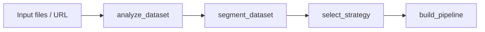
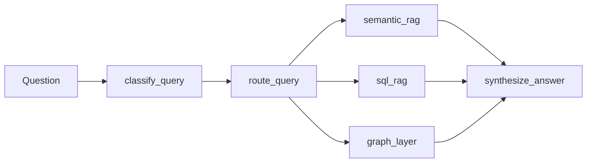

# RAGPilot Architecture

RAGPilot composes retrieval modules from dataset characteristics instead of generating a codebase dynamically.

## Dataset Flow

## Query Flow

## Modules

- Semantic RAG chunks unstructured content, indexes it in ChromaDB when OpenAI is configured, and falls back to local lexical retrieval for demos/tests.
- SQL RAG loads CSV/XLSX files into SQLite, generates read-only SQL, executes it, and returns the query plus rows.
- Graph layer extracts entity co-occurrences and exposes graph JSON for visualization.
- Router sends aggregation questions to SQL, factual questions to semantic retrieval, relationship questions to graph, and mixed questions to hybrid synthesis.

## Web Ingestion

`backend/app/ingestion/web.py` is the source of truth for recursive website ingestion. The root `scraper.py` file is only a small CLI wrapper around that module for standalone crawler testing.
